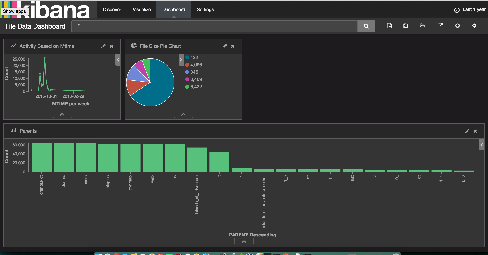

blitzfer
========

Go based filesystem level analytics tool. 

----

## Architecture Overview

Pretty simple really. When all is said and done, this will stand up, ElasticSearch and Kibana containers. A blitzfer container will populate elasticsearch with filesystem metadata. Kibana will visualize said data, once the data exists in elasticsearch. The data can then be reviewed and leveraged for many purposes, such as migration efforts, directory hash balancing, etc.

----

## TODO
1. Containerize App
2. ~~Add YAML config support to the App.~~
3. Daemonize / scheduled fs metadata aggregation.
4. DockerCompose everything for simple deployment.

## Screenshots

Still in its early stages, but here's and example of what I'm going for.

